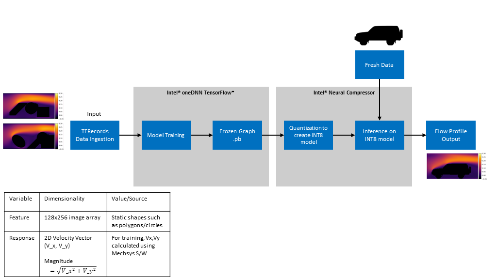

PROJECT NOT UNDER ACTIVE MANAGEMENT

This project will no longer be maintained by Intel.

Intel has ceased development and contributions including, but not limited to, maintenance, bug fixes, new releases, or updates, to this project.  

Intel no longer accepts patches to this project.

If you have an ongoing need to use this project, are interested in independently developing it, or would like to maintain patches for the open source software community, please create your own fork of this project.  

Contact: webadmin@linux.intel.com
# Computational Fluid Dynamics

## Introduction

In this reference kit, we demonstrate how to create a Fluid Flow Profiling by calculating the velocity Profile Around an Object Using the Intel® AI Analytics Toolkit for Tensorflow*, which includes the Intel® Optimization for TensorFlow* to accelerate the training and inference performance when equipped with Intel® hardware, whereas Intel® Neural Compressor is applied to compress the trained segmentation model to further increase speed up inference. Check out more workflow examples in the [Developer Catalog](https://developer.intel.com/aireferenceimplementations).

## Solution Technical Overview

Computational Fluid Dynamics (CFD) have applications in a variety of industries including Aerospace, Automobiles and Energy for engineering design of components, Climate Modeling, Electronics (modeling air flow around chips for effective cooling), Healthcare (flow profiling around medical devices such as stents) and many more. CFD solutions provide a way to completely quantify the flow profile spatially as well as with respect to time by calculating the relevant variables such as velocity, pressure, drag, etc. As a result they can enable components design optimization. This is critical because optimized designs can help lower manufacturing and operational costs through reduced material and energy consumption respectively.

CDF solutions can also be described as fluid flows profiles which are typically calculated by numerically solving the partial differential Navier Stokes (NS) equations governing the environment and boundary conditions. This is usually done through off-the-shelf software such as [Mechsys*](https://mechsys.nongnu.org/) or [Ansys*](https://www.ansys.com/products/fluids/ansys-fluent). However, this is an iterative, time-consuming, and compute and memory intensive job. These factors are a deterrent for rapid design and development of infrastructure where aerodynamics plays a critical role in efficient operation, e.g. design of a wind turbine blade, spoiler of a Formula-1 car or even the stacking of server chips in a large data center, where the wind flow will affect cooling patterns or lead to hot spots.

 Although being highly compute intensive, CFD codes are largely written and optimized [to run on CPU architecture](https://becominghuman.ai/ai-for-cfd-intro-part-1-d1184936fc47). An AI (Deep Learning) based solution can serve as a replacement to numerical simulations, and can provide quick approximate solutions as highlighted [here](https://damassets.autodesk.net/content/dam/autodesk/research/publications-assets/pdf/convolutional-neural-networks-for.pdf). The Deep Learning (DL) model, through a simple inference job, will allow for faster design tests increasing the throughput, and enable quicker design updates.

 This reference kit provides a CFD solution that provides fluid flows profiles through a DL model as an alternative to solving NS equations, which allows saving in time and computational resources while maintaining accuracy and speeding up the inference time by leveraging the following Intel® optimization packages:

- ***Intel® Distribution for Python\****

  The [Intel® Distribution for Python*](https://www.intel.com/content/www/us/en/developer/tools/oneapi/distribution-for-python.html) provides:

  - Scalable performance using all available CPU cores on laptops, desktops, and powerful servers
  - Support for the latest CPU instructions
  - Near-native performance through acceleration of core numerical and machine learning packages with libraries like the - - Intel® oneAPI Math Kernel Library (oneMKL) and Intel® oneAPI Data Analytics Library
  - Productivity tools for compiling Python* code into optimized instructions
  - Essential Python* bindings for easing integration of Intel® native tools with your Python* project

- ***Intel® Optimization for TensorFlow\****

  The [Intel® Optimization for TensorFlow\*](https://www.intel.com/content/www/us/en/developer/tools/oneapi/optimization-for-tensorflow.html):
  - Accelerate AI performance with Intel® oneAPI Deep Neural Network Library (oneDNN) features such as graph optimizations and memory pool allocation.
  - Automatically use Intel® Deep Learning Boost instruction set features to parallelize and accelerate AI workloads.
  - Reduce inference latency for models deployed using TensorFlow Serving*.
  - Starting with TensorFlow* 2.9, take advantage of oneDNN optimizations automatically.
  - Enable optimizations by setting the environment variable TF_ENABLE_ONEDNN_OPTS=1 in TensorFlow* 2.5 through 2.8.

- ***Intel® Neural Compressor***

  The [Intel® Neural Compressor](https://www.intel.com/content/www/us/en/developer/tools/oneapi/neural-compressor.html) is an open-source Python* library designed to help you quickly deploy low-precision inference solutions on popular deep-learning frameworks such as TensorFlow*, PyTorch* , MXNet*, and ONNX* (Open Neural Network Exchange) runtime. The tool automatically optimizes low-precision recipes for deep-learning models to achieve optimal product objectives, such as inference performance and memory usage, with expected accuracy criteria.

For more details, visit [Intel® Distribution for Python](https://www.intel.com/content/www/us/en/developer/tools/oneapi/distribution-for-python.html), [Intel® Extension for TensorFlow*](https://www.intel.com/content/www/us/en/developer/tools/oneapi/optimization-for-tensorflow.html), [Intel® Neural Compressor](https://www.intel.com/content/www/us/en/developer/tools/oneapi/neural-compressor.html), and the [Computational Fluid Dynamics](https://github.com/oneapi-src/computational-fluid-dynamics) GitHub repository.

## Solution Technical Details

The deep learning model for calculating a fluid flow profile will be built using TensorFlow*. As will be seen subsequently, the input for training will be images with random geometric shapes around which the fluid flow profile will be calculated. This will henceforth be referred to as **boundary**. The output will be a 2D velocity vector (Vx,Vy) at each pixel denoting the velocity value at each location. This can then be converted into a fluid profile image for visual representation.

This section provides key implementation details on the proposed reference solution for the target use case. It is organized as follows:

1. Dataset details
2. Neural network (NN) architecture
3. Sample images of DL driven fluid flow profiles

### **1. Dataset Details**

The dataset was sourced from the following [Github repo](https://github.com/loliverhennigh/Steady-State-Flow-With-Neural-Nets).

The dataset can be found [here](https://drive.google.com/file/d/0BzsbU65NgrSuZDBMOW93OWpsMHM/view?resourcekey=0-dEi3hquqjssyK9x-skNL-w).

The dataset is a tfrecords file (a TensorFlow* data format) consisting of 3001 images of random geometric shapes and the profile of a fluid flowing around it. The images include "boundary" of the shape which represents the features and a 2D velocity (Vx, Vy) vector which is the label. For more context, the velocity vector for training was calculated using Mechsys* software. Validating the ground truth is outside the scope of this reference solution and the data is used as is for our experiments.

### **2. Neural Network (NN) Architecture**

We will use a U-net based architecture - a convolutional neural network originally developed for [biomedical image segmentation](https://arxiv.org/pdf/1505.04597.pdf). The advantage of using such an architecture is that it can work with fewer training images but still yield precise results. It consists of a number of downsampling layers followed by a bridging layer connected to a number of upsampling layers. This approach was also used in the source repo and more details are published [here](https://arxiv.org/pdf/1710.10352.pdf).

The schematic of our U-net based architecture is shown in the diagram below. In the code we have used the Keras* library to construct the network.


### **3. Sample images of DL driven fluid flow profiles**

In subsequent sections we delve into the details of the end-to-end reference architecture in greater detail. Before that it will be beneficial to look at some sample images of the fluid flow profiles to validate the approach at the outset. Shown below, are a couple of sample images which include the ground truth (NS equation), DL solution and the difference. We can see that the difference between the DL solution and ground truth is negligible.


The model used here was trained on 2560 images for 50 epochs, with a batch size of 8. The final loss Mean-Squared Error (MSE) value was 4.82e-6.

We also tested the same model on vehicle boundaries, which are completely different than the geometric shapes on which the model was trained. There was no Mechsys* ground truth available for these data but as can be seen from the images below, the profiles are reasonable. We can see that the vehicle boundary is not entirely smooth. This was because the boundary image had a different resolution than the training data and had to be resized before running inference.


## Validated Hardware Details

There are workflow-specific hardware and software setup requirements depending on how the workflow is run.

| Recommended Hardware
| ----------------------------
| CPU: Intel® 2nd Gen Xeon® Platinum 8280 CPU @ 2.70GHz or higher
| RAM: 187 GB
| Recommended Free Disk Space: 20 GB or more

- Operating system: Ubuntu\* 22.04 LTS

## How it Works

A schematic of the proposed reference end-to-end (E2E) architecture is shown in the following figure:



We start off with ingestion of the tfrecords data. As mentioned before, the tfrecords data consist of 3001 tensors which include the shape which represents the features - we will refer to this as the "boundary" - and a 2D velocity (Vx, Vy) vector which we will refer to as the "label". The velocity vector for training is calculated using Mechsys*. tfrecords data are already in a structured format and do not need to be processed further. The feature and label, however can be plotted as an image to visually depict the velocity profile and is shown in the pipeline as a representational example.

The data is then used to train a DL model based on a U-Net architecture and saved as a TensorFlow* model directory. It will then be converted to a frozen graph (.pb) and the converted model can then be used to run inference on new data. The frozen graph consolidates all model parameters into a single file. This increases its utility, for example, it allows seamless deployment, conversion to other frameworks and is also the preferred choice for quantization using Intel® Neural Compressor which we will cover later in the reference solution.

The new data used for inference can either be a section from the original dataset which has been set aside for testing or it can also be simple grayscale images of shapes around which we want to calculate the velocity profile, e.g. a vehicle contour. We will test both options here independently. The first one will allow us evaluate model accuracy of unseen test data because the ground truth for the test data is available as part of the data offering. The second option will allow us to investigate how versatile the model on completely different shapes - we will use car profiles here. The ground truths for these images are not available. Hence, model accuracy cannot be quantified but we can verify whether the prediction is reasonable by a visual check.

The output will be a 2D Vx,Vy value for each pixel in the image which can be plotted as a velocity profile as shown in the output.

## Get Started

The following variables could be adapted by the user and will be used during the E2E workflow.

[//]: # (capture: baremetal)

```bash
export WORKSPACE=$PWD/computational-fluid-dynamics
```

Define `DATA_DIR` and `OUTPUT_DIR` as follows:

[//]: # (capture: baremetal)

```bash
export DATA_DIR=$WORKSPACE/data
export OUTPUT_DIR=$WORKSPACE/output
export SRC_DIR=$WORKSPACE/src
mkdir -p $OUTPUT_DIR
```

Before continuing, if you experience any issue, please check [Known Issues and Troubleshooting Steps](#known-issues-and-troubleshooting-steps).

### Download the Workflow Repository

Clone the Computational Fluid Dynamics repository:

```bash
git clone https://github.com/oneapi-src/computational-fluid-dynamics $WORKSPACE
```

### Set Up Conda

1. Download the appropriate Miniconda Installer for linux.

    ```bash
    wget -q https://repo.anaconda.com/miniconda/Miniconda3-latest-Linux-x86_64.sh
    ```

2. In your terminal window, run.

    ```bash
    bash Miniconda3-latest-Linux-x86_64.sh
    ```

3. Delete downloaded file.

    ```bash
    rm Miniconda3-latest-Linux-x86_64.sh
    ```

To learn more about conda installation, see the [Conda Linux installation instructions](https://docs.conda.io/projects/conda/en/stable/user-guide/install/linux.html).

### Set Up Environment

The `./env/intel_env.yml` file contains all dependencies to create the Intel® environment necessary for running the workflow.

Execute next commands to create and activate the `fluid_dynamics_intel` conda environment.

```bash
conda install -n base conda-libmamba-solver
conda config --set solver libmamba
conda env create -f env/intel_env.yml -y
conda activate fluid_dynamics_intel
```

Environment setup is required only once. This step does not cleanup the existing environment with the same name hence we need to make sure there is no conda environment with the same name.
During this setup, `fluid_dynamics_intel` conda environment will be created with the dependencies listed in the YAML configuration.

| **YAML file Package**  | **Version** |
| ---------------------  | ----------- |
| python                 | 3.9         |
| intel-aikit-tensorflow | 2024.1.0    |
| intelpython3_core      | 2024.1.0    |
| neural-compressor      | 2.4.1       |
| tensorflow             | 2.15.0      |
| matplotlib             | 3.8.4       |
| gdown                  | 5.1.0       |
| werkzeug               | 3.0.2       |
| pillow                 | 10.3.0      |

### Download the Datasets

The following instructions are provided to download two types of data:

  1. tfrecords file for training the models.
  2. Several `.png` images of vehicle profiles for running inference only. For this part, even the textual representation of the images will be downloaded but you can ignore those *.txt files as the png processing is included in the inference scripts and we will use the png files only.

> Please see this dataset's applicable license for terms and conditions. Intel® Corporation does not own the rights to this dataset and does not confer any rights to it.

[//]: # (capture: baremetal)

```bash
cd $DATA_DIR
gdown "https://drive.google.com/u/0/uc?id=0BzsbU65NgrSuZDBMOW93OWpsMHM&export=download"
cd $DATA_DIR/cars
bash download_car_data.sh
```

Once the download instructions are executed, you will have the tfrecords file in the `$DATA_DIR` folder and the car profile png images in the `$DATA_DIR/cars` folder. You can then move on to model training.

## Supported Runtime Environment

You can execute the references pipelines using the following environments:

- [Bare Metal](#run-using-bare-metal)

---

## Run Using Bare Metal

>Follow these instructions to set up and run this workflow on your own development system.

With recommended hardware, it should take about 5 minutes from downloading data to get the final results.

## Set Up System Software

>Our examples use the ``conda`` package and environment on your local computer. If you don't already have ``conda`` installed, go to [Set up conda](#set-up-conda) or see the [Conda Linux installation instructions](https://docs.conda.io/projects/conda/en/stable/user-guide/install/linux.html).

## Run Workflow

### **1. Model Training**

For model training we use a standard learning rate of `0.0001` and train the model for 5 epochs. After 5 epochs, we found that the loss mean squared errors (MSE) values reached as low as `1e-5`. Even though the loss would continue to decrease beyond that, the decrease was extremely slow. As a result in the interest of time and consistency, we decided to train the model for 5 epochs for all benchmarking experiments. The only thing that was varied was the batch size. That being said, the number of epochs can be changed by passing that as an argument in the execution command.

The training benchmarks can be obtained by executing the script `train_TF_model.py`. It executes the following tasks:

1. Data Ingestion
2. Train/test split (random seed is set so that the split is reproducible)
3. Divide the data in batches
4. Training a TensorFlow* model on the train portion of the data for 5 epochs
5. Saving TensorFlow* model

The data ingestion, model training, model conversion to frozen graph and model inference exercises are executed using Intel® oneDNN optimized TensorFlow* which will leverage oneDNN optimizations by default. Another addition is using Intel® Neural Compressor to quantize the FP32 model to INT8 and run inference using the quantized model.

The script takes the following arguments:

```bash
usage: train_TF_model.py [-l LOGFILE] [-m MODELFILE] [-b batch_size] [-e epochs] [-lossf lossfile] 

relevant arguments:
  -l      LOGFILE,    --logfile     log file to output benchmarking results to
  -m      MODELFILE   --modelfile   directory name to store the TensorFlow model
  -b      batch_size  --batch_size  number of batches
  -e      epochs      --epochs      number of epochs
  -lossf  lossfile    --lossfile    .csv file to save the loss values
```

To run with batch size of 4 and for 5 epochs, and logging the performance to `logs`, we would run this command from the parent directory (after creating the appropriate environment as above):

[//]: # (capture: baremetal)

```bash
cd $WORKSPACE
python $SRC_DIR/train_TF_model.py -b 4 -e 5 -m $OUTPUT_DIR/models/batch_size_4 -l $OUTPUT_DIR/logs/batch_size_4.log -lossf $OUTPUT_DIR/losses/batch_size_4.csv
```

### **2. Model Conversion to Frozen Graph**

Before we run inference benchmarks, we will need to convert the saved TensorFlow* model into a frozen graph (.pb) file. A separate script is provided to make that conversion. The script takes the following arguments:

```bash
usage: convert_keras_to_frozen_graph.py [-s keras_saved_model_directory] [-o output_saved_directory] 

required arguments:
  -s      KERAS_SAVED_MODEL_DIRECTORY,    --keras_saved_model_directory     directory which has the keras model, generated from the training script
  -o      OUTPUT_SAVED_DIRECTORY,         --output_saved_directory          directory where the frozem graph (.pb) will be saved
```

Once the training script is run and a Keras* model is available, run the following command to convert the saved model to a frozen graph:

[//]: # (capture: baremetal)

```bash
cd $WORKSPACE
python $SRC_DIR/convert_keras_to_frozen_graph.py -s $OUTPUT_DIR/models/batch_size_4 -o $OUTPUT_DIR/models/batch_size_4_frozen
```

A frozen graph file named `saved_frozen_model.pb` will be placed in the `$OUTPUT_DIR` directory of the previous execution command.

### **3. Model Inference**

The reference solution architecture for an Intel®-optimized pipeline uses TensorFlow* to enable oneDNN optimizations and use of Intel® Neural Compressor to quantize the TensorFlow* frozen graph model (FP32 to INT8) and accelerate inference performance.

Once the model is trained and converted to a `.pb` file, it can be used to run inference. We will first run inference on the test portion of the tfrecords file as this will also allow us to compare the prediction to the ground truth.

The inference benchmarks can be obtained by executing the script `test_TF_model.py`. It executes the following tasks:

1. Data Ingestion
2. Train/test split (random seed is set so that the split is reproducible)
3. Loading the pre-trained TensorFlow* model
4. Running the inference model on the test data using a specified batch size
5. Creating images to compare prediction to ground truth

The script takes the following arguments:

```bash
usage: test_TF_model.py [-l LOGFILE] [-m MODELFILE] [-b batch_size] [-lossf lossfile]

relevant arguments:
  -l      LOGFILE,      --logfile       log file to output benchmarking results to
  -m      MODELFILE     --modelfile     .pb frozen graph model file to load
  -b      batch_size    --batch_size    number of batches
  -p      plot-images   --plot_images   boolean flag to plot images
  -lossf  LOSSFILE      --loss_file     output batch loss as a data frame 
```

To run with batch size of 4 and plot comparative images, while logging the performance to `logs`, we would run this command from the parent directory (after creating the appropriate environment as above):

[//]: # (capture: baremetal)

```bash
cd $WORKSPACE
python $SRC_DIR/test_TF_model.py -b 4 -m $OUTPUT_DIR/models/batch_size_4_frozen/saved_frozen_model.pb -l $OUTPUT_DIR/logs/batch_size_4_inf.log -lossf $OUTPUT_DIR/losses/batch_size_4_loss.csv -p
```

The `saved_frozen_model.pb` is the frozen graph model that was generated post TensorFlow* model conversion.

### **4. Model Quantization**

The model quantization script usage is as follows with arguments:

```bash
usage: TF_model_INC_quantization.py [-m modelfile] [-o output_path] [-l logfile]

relevant arguments:
  -l      LOGFILE,      --logfile       log file to output benchmarking results to
  -m      MODELFILE     --modelfile     .pb frozen graph model file to load
  -o      OUTPUTPATH    --output_path   output path for the quantized model
```

For example:

[//]: # (capture: baremetal)

```bash
cd $WORKSPACE
python $SRC_DIR/TF_model_INC_quantization.py -m $OUTPUT_DIR/models/batch_size_4_frozen/saved_frozen_model.pb -o $OUTPUT_DIR/models/batch_size_4_frozen/saved_frozen_model_INC.pb -l $OUTPUT_DIR/logs/quantization.log
```

The quantized model can then be used to run model inference in exactly the same way as before, with the only difference being the quantized model passed as an argument.

[//]: # (capture: baremetal)

```bash
cd $WORKSPACE
python $SRC_DIR/test_TF_model.py -b 1 -m $OUTPUT_DIR/models/batch_size_4_frozen/saved_frozen_model_INC.pb -l $OUTPUT_DIR/logs/batch_size_1_inf_INC.log  -lossf $OUTPUT_DIR/losses/batch_size_4_INC.csv -p
```

### **5. Running Benchmarks as a Shell Script**

For simplicity, the model training, conversion and inference benchmarks have been compiled into a single shell script:

1. The shell script will perform model training over 4 different batch sizes (4,8,16,32)
2. Following that it will run the model conversion script for the model generated with batch size 4
3. The frozen graph model generated from #2 will be used to run inference on test data using 4 different batch sizes
4. The frozen graph model generated from #2 will then be quantized using Intel® Neural Compressor and saved
5. The quantized model generated from #4 will be used to run inference on test data using 4 different batch sizes

When the shell job is executed, output for each of the benchmarking scripts will be dumped into the file "output.txt". This is to avoid cmd line output which is temporary and available only as long as the window is open. Having it in an output file allows the user to refer back to it later for debugging. As a result, the cmd window will be frozen. Please be patient as the scripts are executed sequentially and track updates in output.txt

To run the benchmarking experiments as a single shell script execute the following commands:

[//]: # (capture: baremetal)

```bash
cd $WORKSPACE
bash $SRC_DIR/run_benchmarks.sh
```

The output logs, loss files and models will be saved in the relevant folders.

### **6. Testing on completely different geometries**

The reference solution was built on fluid flow data for random geometric shapes, including training and validation. However, the versatility of trained model was high enough that we could get reasonable results even for completely different geometries, e.g. car profiles. Once the sample images for cars are uploaded in the relevant `$DATA_DIR/cars` folder as described previously, we can execute a separate inference script (usage and syntax as follows) for obtaining the fluid flow profiles around the car's boundary.

```bash
usage: test_TF_model_cars.py [-m modelfile] [-c carfile]

relevant arguments:
  -m      MODELFILE     --modelfile      .pb frozen graph model file to load
  -c      CARFILE       --carfile        input path for car profile image
```

For example:

[//]: # (capture: baremetal)

```bash
cd $WORKSPACE
python $SRC_DIR/test_TF_model_cars.py -m $OUTPUT_DIR/models/batch_size_4_frozen/saved_frozen_model.pb -p -c $DATA_DIR/cars/car_001.png
```

The ground truth is not provided for this test case and hence the accuracy (MSE) cannot be quantified, however from the the sample output that was shown before the profile intuitively looks reasonable.

## Summary and Next Steps

**Business Perspective:** As mentioned before, an AI based model can provide a faster alternative to numerically solving NS equations to calculate fluid flow profiles. This approach in itself can accelerate the component design and development. Furthermore, using Intel® optimized technologies, for example, TensorFlow* with oneDNN optimizations and INT8 quantization using Intel® Neural Compressor for inference can accelerate pipelines even further. This is critical for workloads deployed on modest CPU architectures such as on-prem servers which cannot be customized or even local workstations. These benefits definitely outweigh the negligible accuracy losses seen in an AI based solution.

**Note on Performance Gain:** The performance gain is dependent on multiple factors such as hardware infrastructure, hyperparameters, trained model, data size, structure etc. The hardware chosen here is a typical VM configuration that customers use and the rest of the parameters are choices governed by the dataset as well as the computational capability. Changing any of these, which users are free to do, will change the performance numbers. The main objective of this reference kit is to demonstrate that an AI based model can provide a much faster solution compared to solving NS equations numerically, with negligible loss in accuracy. The presented results confirm that.

## Known Issues and Troubleshooting Steps

1. ImportError: libGL.so.1: cannot open shared object file: No such file or directory

    **Issue:**
      When training the model using `train_tf_model.py`,

    ```bash
      ImportError: libGL.so.1: cannot open shared object file: No such file or directory
      or
      libgthread-2.0.so.0: cannot open shared object file: No such file or directory
    ```

    **Solution:**

      Install the libgl11-mesa-glx and libglib2.0-0 libraries. For Ubuntu this will be:

    ```bash
      sudo apt install libgl1-mesa-glx
      sudo apt install libglib2.0-0
    ```

2. Import Error for libstdc++

    **Issue:**
      When testing the model using `test_tf_model.py`,

    ```bash
      ImportError: /lib/x86_64-linux-gnu/libstdc++.so.6: version `GLIBCXX_3.4.29' not found
    ```

    **Solution:**

    Install libstdc++6 using the following steps:

    ```bash
    sudo apt-get install software-properties-common
    sudo add-apt-repository ppa:ubuntu-toolchain-r/test
    sudo apt-get update
    sudo apt-get install gcc-4.9
    sudo apt-get upgrade libstdc++6
    ```

## Learn More

For more information about or to read about other relevant workflow examples, see these guides and software resources:

- [Intel® AI Analytics Toolkit (AI Kit)](https://www.intel.com/content/www/us/en/developer/tools/oneapi/ai-analytics-toolkit.html)
- [Intel® Distribution for Python](https://www.intel.com/content/www/us/en/developer/tools/oneapi/distribution-for-python.html)
- [Intel® oneDNN optimized TensorFlow\*](https://www.intel.com/content/www/us/en/developer/tools/oneapi/optimization-for-tensorflow.html#gs.174f5y)
- [Intel® Neural Compressor](https://www.intel.com/content/www/us/en/developer/tools/oneapi/neural-compressor.html#gs.5vjr1p)

## Support

If you have questions or issues about this use case, want help with troubleshooting, want to report a bug or submit enhancement requests, please submit a GitHub issue.

## Notices and Disclaimers

Mechsys*: See https://mechsys.nongnu.org/ for more information.

Please see this dataset's applicable license for terms and conditions. Intel® Corporation does not own the rights to this dataset and does not confer any rights to it.

\*Other names and brands that may be claimed as the property of others. [Trademarks](https://www.intel.com/content/www/us/en/legal/trademarks.html).

To the extent that any public or non-Intel® datasets or models are referenced by or accessed using tools or code on this site those datasets or models are provided by the third party indicated as the content source. Intel® does not create the content and does not warrant its accuracy or quality. By accessing the public content, or using materials trained on or with such content, you agree to the terms associated with that content and that your use complies with the applicable license.

Intel® expressly disclaims the accuracy, adequacy, or completeness of any such public content, and is not liable for any errors, omissions, or defects in the content, or for any reliance on the content. Intel® is not liable for any liability or damages relating to your use of public content.

Performance varies by use, configuration, and other factors. Learn more on the [Performance Index site](https://edc.intel.com/content/www/us/en/products/performance/benchmarks/overview/).

Intel® Corporation. Intel®, the Intel® logo, and other Intel® marks are trademarks of Intel® Corporation or its subsidiaries. Other names and brands may be claimed as the property of others.
