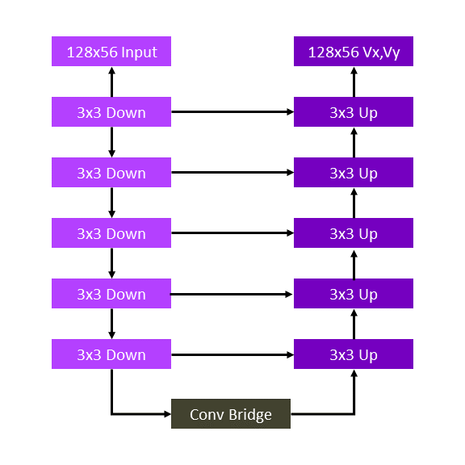

# **Fluid Flow Profiling - Calculating The Velocity Profile Around an Object Using Tensorflow**

Computational Fluid Dynamics (CFD) have applications in a variety of industries including Aerospace, Automobiles and Energy for engineering design of components, Climate Modeling, Electronics (modeling air flow around chips for effective cooling), Healthcare (flow profiling around medical devices such as stents) and many more. CFD solutions provide a way to completely quantify the flow profile spatially as well as with respect to time by calculating the relevant variables such as velocity, pressure, drag, etc. As a result they can enable optimizing the design of components. This is critical because optimized designs can help lower manufacturing and operational costs through reduced material and energy consumption respectively.


# **Contents**
 - [Purpose](#purpose)
 - [Reference Solution](#reference-solution)
 - [Comparing Performance Benefits](#comparing-performance-benefits)
 - [Key Takeaways and Discussion](#key-takeaways-and-discussion)
 - [Appendix](#appendix)

 ## **Purpose**

 CFD solutions, in other words, fluid flow profiles are typically calculated by numercially solving the partial differential Navier Stokes (NS) equations governing the environment and boundary conditions. This is usually done through off-the-shelf software such as [Mechsys](https://mechsys.nongnu.org/) or [Ansys](https://www.ansys.com/products/fluids/ansys-fluent). However, this is an iterative, time consuming, and compute and memory intensive job. These factors are a deterrent for rapid design and development of infrastucture where aerodynamics plays a critical role efficient operation, e.g. design of a wind turbine blade, spoiler of a Formula-1 car or even the stacking of server chips in a large data center, where the wind flow will affect cooling patterns or lead to hot spots.

 Although being highly compute intensive, CFD codes are largely written and optimized [to run on CPU architecture](https://becominghuman.ai/ai-for-cfd-intro-part-1-d1184936fc47). An AI (Deep Learning) based solution can serve as a replacement to numerical simulations, and can provide quick approximate solutions as highlighted [here](https://damassets.autodesk.net/content/dam/autodesk/research/publications-assets/pdf/convolutional-neural-networks-for.pdf). The Deep Learning (DL) model, through a simple inference job, will allow for faster design tests increasing the throughput, and enable quicker design updates. 

## **Reference solution**

The deep learning model for calculating a fluid flow profile will be built using Tensorflow. As will be seen subsequently, the input for training will be images with random geometric shapes around which the fluid flow profile will be calculated. This will henceforth be referred to as **boundary**. The output will be a 2D velocity vector (Vx,Vy) at each pixel denoting the velocity value at each location. This can then be converted into a fluid profile image for visual representation

This section provides key implementation details on the proposed reference solution for the target use case. It is organized as follows:

1. Dataset details
2. Neural network (NN) architecture
3. Sample images of DL driven fluid flow profiles
4. Proposed reference end-to-end architecture
5. Setting up the stock environment
6. Executing the reference architecture pipeline components
7. Optimizing the reference solution pipeline using libraries from the Intel AI Analytics Toolkit.

### **Dataset Details**
The dataset was sourced from the following Github repo:
https://github.com/loliverhennigh/Steady-State-Flow-With-Neural-Nets

The dataset can be found [here](https://drive.google.com/file/d/0BzsbU65NgrSuZDBMOW93OWpsMHM/view?resourcekey=0-dEi3hquqjssyK9x-skNL-w).

The dataset is a tfrecords file (a Tensorflow data format) consisting of 3001 images of random geometric shapes and the profile of a fluid flowing around it. The images include "boundary" of the shape which represents the features and a 2D velocity (Vx, Vy) vector which is the label. Fore more context, the velocity vector for training was calculated using Mechsys software. Validating the ground truth is outside the scope of this reference solution and the data is used as is for our experiments.

### **Neural Network (NN) Architecture**
We will use a U-net based architecture - a convolutional neural network originally developed for [biomedical image segmentation](https://arxiv.org/pdf/1505.04597.pdf). The advantage of using such an architecture is that it can work with fewer training images but still yield precise results. It consists of a number of downsampling layers, a bridging layer followed  by a number of upsampling layers. This approach was also used in the source repo and more details are published [here](https://arxiv.org/pdf/1710.10352.pdf). 

The schematic of our U-net based architecture is shown in the diagram below. In the code we have used the Keras library to construct the network.



### **Sample images of DL driven fluid flow profiles**
In subsequent sections we delve into the details of the end-to-end reference architecture in greater detail. Before that it will be beneficial to look at some sample images of the fluid flow profiles to validate the approach at the outset. Shown below, are a couple of sample images which include the ground truth (NS equation), DL solution and the difference. We can see that the difference between the DL solution and ground truth is negligible.


The model used here was trained on 2560 images for 50 epochs, with a batch size of 8. The final loss (Mean-Squared Error) value was 4.82e-6.

We also tested the same model on vehicle boundaries, which are completely different than the geometric shapes on which the model was trained. There was no Mechsys ground truth available for these data but as can be seen from the images below, the profiles are reasonable. We can see that the vehicle boundary is not entirely smooth. This was because the boundary image had a different resolution than the training data and had to be resized before running inference.


### **Proposed Architecture**

A schematic of the proposed reference architecture is shown in the following figure. We start off with ingestion of the tfrecords data. As mentioned before, the tfrecords data consist of 3001 tensors which include the shape which represents the features - we will refer to this as the "boundary" - and a 2D velocity (Vx, Vy) vector which we will refer to as the "label". The velocity vector for training is calculated using Mechsys. tfrecords data are already in a structured format and do not need to be processed further. The feature and label, however can be plotted as an image to visually depict the velocity profile and is shown in the pipeline as a representational example.

The data is then used to train a DL model based on a U-Net architecture and saved as a Tensorflow model directory. It will then be converted to a frozen graph (.pb) and the converted model can then be used to run inference on new data. The frozen graph consolidates all model parameters into a single file. This increases its utility, for example, it allows seamless deployment, conversion to other frameworks and is also the preferred choice for quantization using Intel Neural Compressor which we will cover later in the reference solution. 

The new data used for inference can either be a section from the original dataset which has been set aside for testing or it can also be simple grayscale images of shapes around which we want to calculate the velocity profile, e.g. a vehicle contour. We will test both options here independently. The first one will allow us evaluate model accuracy of unseen test data because the ground truth for the test data is available as part of the data offering. The second option will allow us to investigate how versatile the model on completely different shapes - we will use car profiles here. The ground truths for these images are not available. Hence, model accuracy cannot be quantified but we can verify whether the prediction is reasonable by a visual check.

The output will be a 2D Vx,Vy value for each pixel in the image which can be plotted as a velocity profile as shown in the output.


### **Stock Packages Used**
- Python v3.9
- numPy v1.23.5
- tensorflow v2.8.0
- matplotlib v3.6.2

> **Note**: If you wish to explore the reference kits on machines using Windows, first go to the [Running on Windows](##running-on-windows) section to ensure that WSL is setup, then return here.

> **Note**: The performance measurements were captured on Xeon based processors. The instructions will work on WSL, however some portions of the ref kits may run slower under that setup. Additionally performance claims reported may not be seen on a Windows based client machine.

### **Setting up Stock Environment**

Before setting up environment and running benchmarks please check [Known Issues and Troubleshooting Steps](#known-issues-and-troubleshooting-steps) in case you run into the same issues.

To execute the scripts provided in the reference kit, you will need to work on the Anaconda platform. Download and installation instructions for a Linux machine can be found [here](https://docs.anaconda.com/anaconda/install/linux/)

Once Anaconda is installed, clone the git repository using the following command:
```shell
git clone https://github.com/oneapi-src/computational-fluid-dynamics
```

Move into the cloned folder to set the environment.
```shell
cd oneAPI-FluidFlowProfiling
```

The script `setupenv.sh` is provided to automate the setup of the conda environments necessary for this reference kit. Once you clone the git repo on your workstation/virtual machine (VM), in the parent directory you just moved to, execute the following command

```shell
chmod +rwx setupenv.sh
./setupenv.sh
```
This will prompt for the selection of stock/intel packages. Select 1 for stock

Example option selection for creating stock/intel environment as given below
```shell
Select technology distribution:
    1. stock 
    2. intel
```
Once the environment is setup, activate the stock environment using the following command.

```shell
conda activate CFD_stock
```
You can then move ahead to data download and executing the model training/inference pipelines

### **Data Ingestion**

Please download the data using the instructions provided in the `/data` folder. Instructions are provided to download two types of data 
  1. tfrecords file for training the model S
  2. Several `.png` images of vehicle profiles for running inference only. For this part, even the textual representation of the images will be downloaded but you can ignore those *.txt files as the png processing is included in the inference scripts and we will use the png files **only**

Once the download instructions are executed, please you will have the tfrecords file in the /data folder and the car profile png images in the /cars folder. You can then move on to model training

### **Model Training**

For model training we use a standard learning rate of 0.0001 and train the model for 5 epochs. After 5 epochs, we found that the loss (MSE) values reached as low as 1e-5. Even though the loss would continue to decrease beyond that, the decrease was extremely slow. As a result in the interest of time and consistency, we decided to train the model for 5 epochs for all benchmarking experiments. The only thing that was varied was the batch size. That being said, the number of epochs can be changed by passing that as an argument in the execution command.

The training benchmarks can be obtained by executing the script `train_TF_model.py`. It executes the following tasks:

1. Data Ingestion
2. Train/test split (random seed is set so that the split is reproducible)
3. Divide the data in batches
4. Training a Tensorflow model on the train portion of the data for 5 epochs
5. Saving Tensorflow model 

The script takes the following arguments:

```shell
usage: train_TF_model.py [-l LOGFILE] [-m MODELFILE] [-b batch_size] [-e epochs] [-lossf lossfile] 

relevant arguments:
  -l      LOGFILE,    --logfile     log file to output benchmarking results to
  -m      MODELFILE   --modelfile   directory name to store the tensorflow model
  -b      batch_size  --batch_size  number of batches
  -e      epochs      --epochs      number of epochs
  -lossf  lossfile    --lossfile    .csv file to save the loss values
```
To run with batch size of 4 and for 5 epochs, and logging the performance to `logs`, we would run this command from the parent directory (after creating the appropriate environment as above):
```shell
python ./src/train_TF_model.py -b 4 -e 5 -m ./models/stock/batch_size_4 -l ./logs/stock/batch_size_4.log -lossf ./losses/stock/batch_size_4.csv
```

### **Model Coversion to Frozen Graph**

Before we run inference benchmarks, we will need to convert the saved tensorflow model into a frozen graph (.pb) file. A separate script is provided to make that conversion. The script takes the following arguments

```shell
usage: convert_keras_to_frozen_graph.py [-s keras_saved_model_directory] [-o output_saved_directory] 

required arguments:
  -s      KERAS_SAVED_MODEL_DIRECTORY,    --keras_saved_model_directory     directory which has the keras model, generated from the training script
  -o      OUTPUT_SAVED_DIRECTORY,         --output_saved_directory          directory where the frozem graph (.pb) will be saved
```

Once the training scripts are run and a keras model is available, run the following command to convert the saved model to a frozen graph:

```shell
python ./src/convert_keras_to_frozen_graph.py -s ./models/stock/batch_size_4 -o ./models/stock/batch_size_4_frozen
```

A frozen graph file named `saved_frozen_model.pb` will be placed in the output directory of the previous execution command

### **Model Inference**

Once the model is trained and converted to a `.pb` file, it can be used to run inference. We will first run inference on the test portion of the tfrecords file as this will also allow us to compare the prediction to the ground truth.

The inference benchmarks can be obtained by executing the script `test_TF_model.py`. It executes the following tasks:

1. Data Ingestion
2. Train/test split (random seed is set so that the split is reproducible)
3. Loading the pre-trained tensorflow model
4. Running the inference model on the test data using a specified batch size
5. Creating images to compare prediction to ground truth

The script takes the following arguments:

```shell
usage: test_TF_model.py [-l LOGFILE] [-m MODELFILE] [-b batch_size] [-lossf lossfile]

relevant arguments:
  -l      LOGFILE,      --logfile       log file to output benchmarking results to
  -m      MODELFILE     --modelfile     .pb frozen graph model file to load
  -b      batch_size    --batch_size    number of batches
  -p      plot-images   --plot_images   boolean flag to plot images
  -lossf  LOSSFILE      --loss_file     output batch loss as a data frame 
```
To run with batch size of 4 and plot comparitive images, while logging the performance to `logs`, we would run this command from the parent directory (after creating the appropriate environment as above):
```shell
python ./src/test_TF_model.py -b 4 -m ./models/stock/batch_size_4_frozen/saved_frozen_model.pb -l ./logs/stock/batch_size_4_inf.log -lossf ./losses/stock/batch_size_4_loss.csv -p
```

The `saved_frozen_model.pb` is the frozen graph model that was generated post tensorflow model conversion.

### **Running Benchmarks as a Shell Script in the Stock Environment**

For simplicity, the model training, conversion and inference benchmarks have been compiled into a single shell script: 
1. The shell script will perform model training over 4 diifferent batch sizes (4,8,16,32)
2. Following that it will run the model conversion script for the model generated with batch size 4
3. The frozen graph model generated from #2 will be used to run inference on test data using 4 different batch sizes

When the shell job is executed, output for each of the benchmarking scripts will be dumped into the file "output.txt". This is to avoid cmd line output which is temporary and available only as long as the window is open. Having it in an output file allows the user to refer back to it later for debugging. As a result, the cmd window will be frozen. Please be patient as the scripts are executed sequentially and track updates in output.txt

To run the benchmarking experiments as a single shell script execute the following commands:
```shell
conda activate CFD_stock
chmod +rwx run_benchmarks_stock.sh
./run_benchmarks_stock.sh
```

The output logs, loss files and models will be saved in the relevant folders.

## **Optimizing the Reference solution using libraries from the Intel AI Analytics Toolkit**

The reference solution architecture for an Intel-optimized pipeline is largely unchanged except the execution using Tensorflow 2.10.0 to enable oneDNN optimizations and use of Intel Neural Compressor (INC) to quantize the tensorflow frozen graph model (FP32 to INT8) and accelerate inference performance. 


### **Intel Packages Used**

- Python v3.9
- numPy v1.22.3
- tensorflow v2.10.0
- matplotlib v3.6.2
- Intel Neural Compressor v1.14.2

### **Setting up Intel Environment**

Follow the same instructions as the ones for setting up a stock environment. 

Move into the cloned folder to set the environment.
```shell
cd oneAPI-FluidFlowProfiling
```

Execute the following commands (the execute permissions will already be assigned duruing stock env creation, but is listed here in case intel env is created first)

```shell
chmod +rwx setupenv.sh
./setupenv.sh
```
This will prompt for the selection of stock/intel packages. Select 2 for intel.

```shell
Select technology distribution:
    1. stock
    2. intel
```
Once the environment is setup, activate the intel environment using the following command.

```shell
conda activate CFD_intel
```

### **Executing Benchmarks in an Intel Environment**

Once the Intel environment is created, you can then move ahead to executing the pipeline using the Intel-optimized packages.

The data ingestion, model training, model conversion to frozen graph and model inference exercises are identical to how it was setup for the stock version with the only exception that the pipeline will be executed using Tensorflow v2.10.0 which will leverage oneDNN optimizations by default. Another addition is using INC to quantize the FP32 model to INT8 and run inference using the quantized model.

Following are examples of how the main pipeline components (similar to stock) can be executed in an Intel environment

```shell
python ./src/train_TF_model.py -b 4 -e 5 -m ./models/intel/batch_size_4 -l ./logs/intel/batch_size_4.log -lossf ./losses/intel/batch_size_4.csv

python ./src/convert_keras_to_frozen_graph.py -s ./models/intel/batch_size_4 -o ./models/intel/batch_size_4_frozen

python ./src/test_TF_model.py -b 4 -m ./models/intel/batch_size_4_frozen/saved_frozen_model.pb -l ./logs/intel/batch_size_4_inf.log -lossf ./losses/intel/batch_size_4.csv  -p
```

The model quantization script usage is as follows with arguments:

```shell
usage: TF_model_INC_quantization.py [-m modelfile] [-o output_path] [-l logfile]

relevant arguments:
  -l      LOGFILE,      --logfile       log file to output benchmarking results to
  -m      MODELFILE     --modelfile     .pb frozen graph model file to load
  -o      OUTPUTPATH    --output_path   output path for the quantized model
```

For example:

```shell
python ./src/TF_model_INC_quantization.py -m ./models/intel/batch_size_4_frozen/saved_frozen_model.pb -o ./models/intel/batch_size_4_frozen/saved_frozen_model_INC.pb -l ./logs/intel/quantization.log
```

The quantized model can then be used to run model inference in exactly the same way as before, with the only difference being the quantized model passed as an argument.

```shell
python ./src/test_TF_model.py -b 1 -m ./models/intel/batch_size_4_frozen/saved_frozen_model_INC.pb -l ./logs/intel/batch_size_1_inf_INC.log  -lossf ./losses/intel/batch_size_4_INC.csv -p
```

### **Running Benchmarks as a Shell Script in the Intel Environment**

Similar to what was described previously, the pipeline components can be executed single shell script: 

1. The shell script will perform model training over 4 diifferent batch sizes (4,8,16,32)
2. Following that it will run the model conversion script for the model generated with batch size 4
3. The frozen graph model generated from #2 will be used to run inference on test data using 4 different batch sizes
4. The frozen graph model generated from #2 will then be quantized using INC and saved
5. The quantized model generated from #4 will be used to run inference on test data using 4 different batch sizes 

Once again, when the shell job is executed, output for each of the benchmarking scripts will be dumped into the file "output.txt". This is to avoid cmd line output which is temporary and available only as long as the window is open. Having it in an output file allows the user to refer back to it later for debugging. As a result, the cmd window will be frozen. Please be patient as the scripts are executed sequentially and track updates in output.txt

To run the benchmarking experiments as a single shell script execute the following commands:
```shell
conda activate CFD_intel
chmod +rwx run_benchmarks_intel.sh
./run_benchmarks_intel.sh
```

The output logs, loss files and models will be saved in the relevant folders.

## **Comparing Performance Benefits**

In this section, we illustrate the benchmarking results comparing the Intel-optimized libraries vs the stock alternative(s).


1. Training a Tensorflow model using v2.10.0 (w/ oneDNN optimiations) compared to v2.8.0 (w/o oneDNN optimizations)


2. Inference using a Tensorflow model (FP32 and INT8 quantized) using v2.10.0 (w/ oneDNN optimiations) compared to v2.8.0 (w/o oneDNN optimizations)


## **Key Takeaways and Discussion**

From the reference solution, we can see that we see a speedup in performance in both training and inference. For training, using Tensorflow v2.10.0 with oneDNN optimizations offers up to **2.31x** speedup over using v2.8.0 without oneDNN optimizations for models trained over 5 epochs. For inference, we get a speedup of up to **1.57x**. If we quantize the FP32 model to an INT8 version using INC, the inference speedup increases to up to **2.67x**.

**Accuracy:** For fluid flow profiling, there is no denying that the accuracy of the results is a critical aspect for design considerations. Hence for an AI solution which approximates the results, the trade-off between the loss in accuracy and the speedup in model training/inference should be examined carefully before adoption. In this reference solution, there are two sources of accuracy loss:
  1. Using an AI based model instead of a numerical solution which is the main premise of our offering
  2. Quantization of the FP32 model to INT8 in order to accelerate inference; We have reported the final results for a few samples paint a complete picture

We have chosen MSE (after flattening the 2D output tensors) to quantify accuracy loss as it is the most common choice for such comparisons. Other metrics can be chosen for this purpose but because in the end the comparison is relative, we anticipate it will not change the final results. The MSE values compared to the ground truth are reported for 3 sample images. The model used for generating these images was trained using a batch size of 4 and 20 epochs. 

   

We can see that the MSE values across the board are of the order of 0.001% when we compare to the ground truth. This demonstrates that an AI solution is extremely close to the numerical solution. Furthermore running an inference using an INT8 quantized model does decrease the accuracy. But the overall error compared to the ground truth is still within the same range as what we observe for an FP32 model. 

Visually as well, as can be seen from below, the difference b/w the ground truth and the AI models (both FP32 and INT8) is negligible.


**Testing on completely different geometries:** The reference solution was built on fluid flow data for random geometric shapes, including training and validation. However, the versatility of trained model was high enough that we could get reasonable results even for completely different geometries, e.g. car profiles. Once the sample images for cars are uploaded in the relevant `/data/cars` folder as described previously, we can execute a separate inference script (usage and syntax as follows) for obtaining the fluid flow profiles around the car's boundary.

```shell
usage: test_TF_model_cars.py [-m modelfile] [-c carfile]

relevant arguments:
  -m      MODELFILE     --modelfile      .pb frozen graph model file to load
  -c      CARFILE       --carfile        input path for car profile image
```

For example:

```
python ./src/test_TF_model_cars.py -m ./models/intel/batch_size_4_frozen/saved_frozen_model.pb -p -c ./cars/car_001.png
```

The ground truth is not provided for this test case and hence the accuracy (MSE) cannot be quantified. However from the the sample output that was shown before the profile intuitively looks reasonable. 

**Business Perspective:** As mentioned before, an AI based model can provide a faster alternative to numerically solving NS equations to calculate fluid flow profiles. This approach in itself can accelerate the component design and development. Furthermore, using Intel optimized technologies, for example, Tensorflow w/ oneDNN optimizations and INT8 quantization using INC for inference can accelerate pipelines even further. This is critical for workloads deployed on modest CPU architectures such as on-prem servers which cannot be customized or even local workstations. These benefits definitely outweigh the negligible accuracy losses seen in an AI based solution.

**Note on Performance Gain:**

The performance gain is dependent on multiple factors such as hardware infrastructure, hyperparameters, trained model, data size and structure etc. The hardware chosen here is a typical VM configuration that customers use and the rest of the parameters are choices governed by the dataset as well as the computational capability. Changing any of these, which users are free to do, will change the performance numbers. The main objective of this reference kit is to demonstrate that an AI based model can provide a much faster solution compared to solving NS equations numerically, with negligible loss in accuracy. The presented results confirm that.


## **Appendix**

### Running on Windows

The original reference kits commands were built using a Linux based system.  In order to run these commands on Windows, go to Start and open WSL.  The Linux instructions provided can then be run in the WSL window starting from the git clone instructions. If WSL is not installed you can [install WSL](https://learn.microsoft.com/en-us/windows/wsl/install).

> **Note** If WSL is installed and not opening, goto Start ---> Turn Windows feature on or off and make sure Windows Subsystem for Linux is checked. Restart the system after enabling it for the changes to reflect.

### **Experiment Setup**
- **Date Testing Performed:** November 2022
- **Configuration Details and Workload Setup:** <br> 
	Azure D8v5 (Intel® Xeon® Platinum 8370C CPU @ 2.80GHz), 1 Socket, 4 Cores per Socket, 2 Threads per Core, Turbo:On <br>
	Total Memory: 32 GB <br>
	OS: Ubuntu 20.04 <br>
	Kernel: Linux 5.15.0-1019-azure <br>
	Software: Tensorflow v2.8.0, Tensorflow  v2.10.0
- **Testing performed by** Intel Corporation
  
| **Configuration**:                | **Description**
| :---                              | :---
| Platform                          | Microsoft Azure: Standard_D8s_v5 (IceLake) <br> Ubuntu 20.04
| Processing Hardware               | Intel IceLake Xeon Platinum 8370C CPU @ 2.8GHz <br> 32GB
|  Software                          | NumPy (stock_version: 1.23.5, intel_version: 1.22.3) <br> Matplotlib (v3.6.2 for both intel and stock envs) <br> Tensorflow (stock version: 2.8.0, intel_version:  2.10.0)  <br> Intel Neural Compressor (v1.14.2 only for Intel env)
| What you will learn               | Intel® oneAPI performance advantage over the stock packages for building AI powered solution for calculating fluid flow profiles

**Operating System:**
We recommend using an Linux OS for executing the reference solution presented here, e.g. RHEL or Ubuntu.

**Known Issues and Troubleshooting Steps**

1. Environment Creation Issue : Could not build wheels for pycocotools

    **Issue:**
      When creating an intel environment using `setupenv.sh` 
      ```
      ERROR: Could not build wheels for pycocotools, which is required to install pyproject.toml-based projects
      ```

    **Solution:**

    Install gcc.  For Ubuntu, this will be: 

      ```bash
      apt install gcc
      ```

2. ImportError: libGL.so.1: cannot open shared object file: No such file or directory
   
    **Issue:**
      When training the model using `train_tf_model.py`,
      
	  ```
      ImportError: libGL.so.1: cannot open shared object file: No such file or directory
      or
      libgthread-2.0.so.0: cannot open shared object file: No such file or directory
      ```

    **Solution:**

      Install the libgl11-mesa-glx and libglib2.0-0 libraries. For Ubuntu this will be:

      ```
      sudo apt install libgl1-mesa-glx
      sudo apt install libglib2.0-0
	  ```

3. Import Error for libstdc++

    **Issue:**
      When testing the model using `test_tf_model.py`,
      
	  ```
      ImportError: /lib/x86_64-linux-gnu/libstdc++.so.6: version `GLIBCXX_3.4.29' not found
      ```

    **Solution:**
	  
	  Install libstdc++6 using the following steps:
	  
	  ```
	  sudo apt-get install software-properties-common
	  sudo add-apt-repository ppa:ubuntu-toolchain-r/test
	  sudo apt-get update
	  sudo apt-get install gcc-4.9
	  sudo apt-get upgrade libstdc++6
	  ```


## **Notes**

**Intel Corporation does not own the rights to this data set and does not confer any rights to it.**

### **Notices and Disclaimers**
Please see this data set's applicable license for terms and conditions. Intel Corporation does not own the rights to this data set and does not confer any rights to it.
Performance varies by use, configuration and other factors. Learn more on the Performance Index site. 
Performance results are based on testing as of dates shown in configurations and may not reflect all publicly available updates.  See backup for configuration details.  No product or component can be absolutely secure. 
Your costs and results may vary. 
Intel technologies may require enabled hardware, software or service activation.
© Intel Corporation.  Intel, the Intel logo, and other Intel marks are trademarks of Intel Corporation or its subsidiaries.  Other names and brands may be claimed as the property of others.  
